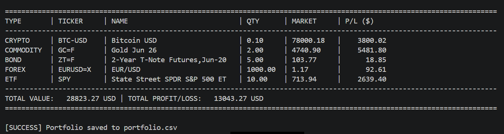
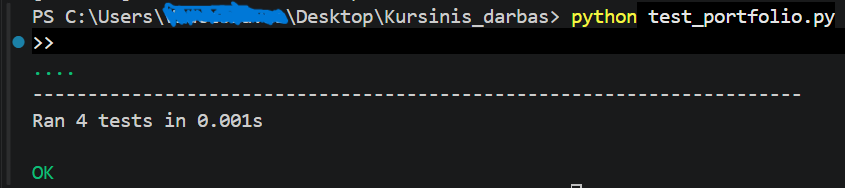

# Coursework: Stock portfolio

## 1. Project Overview
This project is a high-level **Financial Investment Tracking System - Portfolio ** developed in Python. It provides a centralized platform for managing diverse financial assets, including **Equities (Stocks), Cryptocurrencies, Bonds, Commodities (Futures), Forex, and ETFs**. 

The core value of the application lies in its ability to:
*   Integrate with the **Yahoo Finance API** (`yfinance`) for real-time market data.
*   Automate **Profit/Loss (P/L) analytics** based on historical purchase prices.
*   Ensure **Data Persistence** using a robust CSV-based storage system.
*   Maintain high code quality through **Unit Testing** and **Design Patterns**.

---

## 2. Object-Oriented Programming (OOP) Architecture

The system is built on the four fundamental pillars of OOP to ensure scalability and maintainability:

### 2.1 Abstraction
I utilized the `abc` (Abstract Base Classes) module to define the `FinancialInstrument` class as an abstract template. It enforces a strict contract for all asset types through the abstract method `fetch_data()`. This hides the complex API networking logic from the main application flow, providing a clean interface.

### 2.2 Encapsulation
To protect the integrity of financial data, I implemented strict encapsulation. The asset price (`__current_price`) is a **private attribute**, inaccessible from outside the class. I provided controlled access through:
*   **Getter (`get_price`)**: Safely retrieves the latest valuation.
*   **Setter (`set_price`)**: Validates that incoming data is non-negative and numeric before updating the state.

### 2.3 Inheritance
The project features a specialized class hierarchy. Subclasses such as `Stock`, `Crypto`, `Bond`, and `Forex` inherit from the `FinancialInstrument` base class. This structure allows:
*   **Code Reuse**: Shared attributes (Quantity, Buy Price, Ticker) are managed in the parent class.
*   **Specialization**: Each subclass handles its unique identifier format (e.g., auto-appending `-USD` for Crypto or `=F` for Commodities).

### 2.4 Polymorphism
Polymorphism is implemented in the `display_dashboard` function. The system treats all assets as generic `FinancialInstrument` objects. During runtime, Python dynamically determines which subclass method to call (Dynamic Dispatch). This allows the dashboard to calculate P/L for a diverse list of assets using a single unified loop.

---

## 3. Design Patterns
I implemented the **Singleton Pattern** for the `PortfolioManager` class. 
*   **Purpose**: To ensure that the entire application operates on a single instance of the portfolio data. 
*   **Benefit**: This prevents "race conditions" during file operations and ensures that adding an asset in one part of the code is reflected globally, providing a single source of truth.

---

## 4. Implementation Details
*   **Real-time API**: Leveraging `yfinance` to pull live quotes and "Long Names" for a professional UI.
*   **Data Persistence**: A custom CSV handler that saves the **Quantity** and **Purchase Price**, allowing the user to resume their session with all historical data intact.
*   **Robustness**: Included `try-except` blocks to handle network timeouts and invalid ticker symbols from the API.

### Application Preview
Below is the real-time dashboard generated by the system:


---

## 5. Quality Assurance (Unit Testing)
The system includes a dedicated test suite in `test_portfolio.py` using the `unittest` framework. 
**Key Test Cases:**
1.  **Singleton Integrity**: Verifying that multiple constructor calls return the same object.
2.  **Encapsulation Validation**: Ensuring that the system rejects negative price updates.
3.  **Financial Accuracy**: Validating that the P/L formula `(Market - Buy) * Qty` returns mathematically correct results.

### Testing Results
The system passes all internal checks:


---

## 6. Setup and Execution
### Prerequisites
*   Python 3.8+
*   `yfinance` library

### Installation
1. Clone the repository or download the source files.
2. Install dependencies:
   ```bash
   pip install -r requirements.txt
   ```

### Running the Project
*   **Main App**: `python COURSEEEEEEEE.py`
*   **Tests**: `python test_portfolio.py`

---

